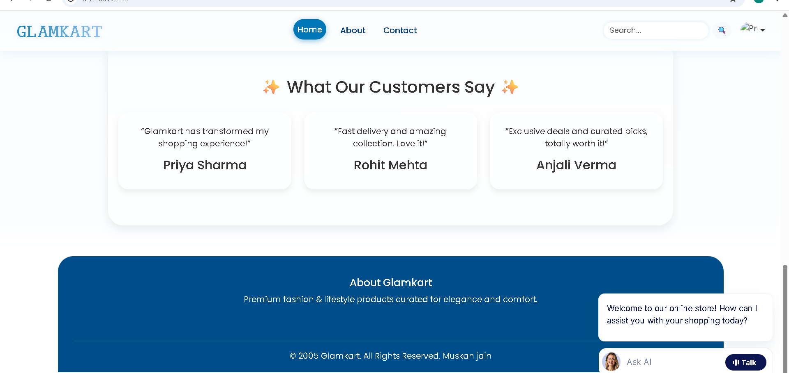
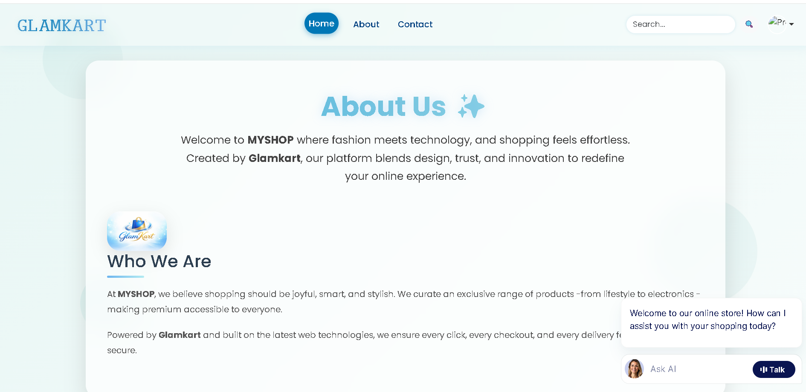

# 🛍️ Glamkart – Django E-Commerce Website

Glamkart is a full-stack **E-Commerce web application** built using **Python Django**. The project includes user authentication, product management, shopping cart, wishlist, order management, an admin dashboard, and an integrated **AI Shopping Assistant** for a better shopping experience.

## ✨ Features

- User Registration & Login
- Product Categories & Search
- Shopping Cart & Wishlist
- Checkout & Order Management
- User Profile
- Product Reviews
- Notifications
- Admin Dashboard
- AI Shopping Assistant
- Responsive Design

## 🛠️ Tech Stack

- Python
- Django
- HTML
- CSS
- JavaScript
- Bootstrap
- SQLite

## 📷 Project Preview





## 🚀 Installation

```bash
git clone https://github.com/MuskanJain-tech/Glamkart.git
cd Glamkart

python -m venv venv
venv\Scripts\activate

pip install -r requirements.txt

python manage.py migrate
python manage.py runserver
```

Open:

```
http://127.0.0.1:8000/
```

## 👩‍💻 Author

**Muskan Jain**

GitHub: https://github.com/MuskanJain-tech

⭐ If you like this project, consider giving it a star.
